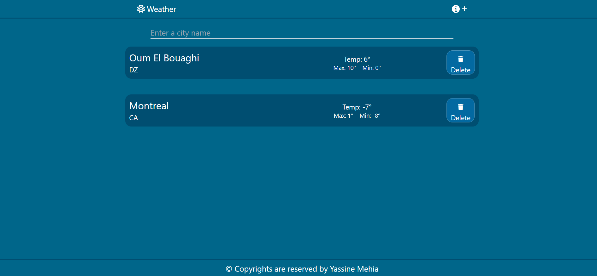
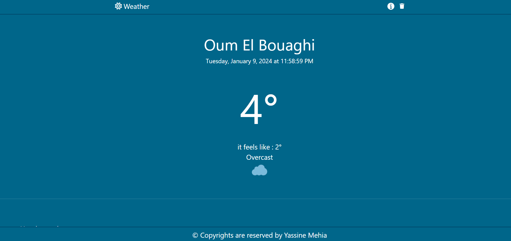
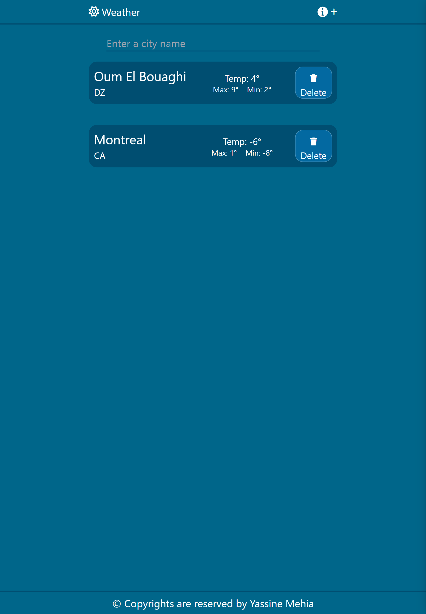
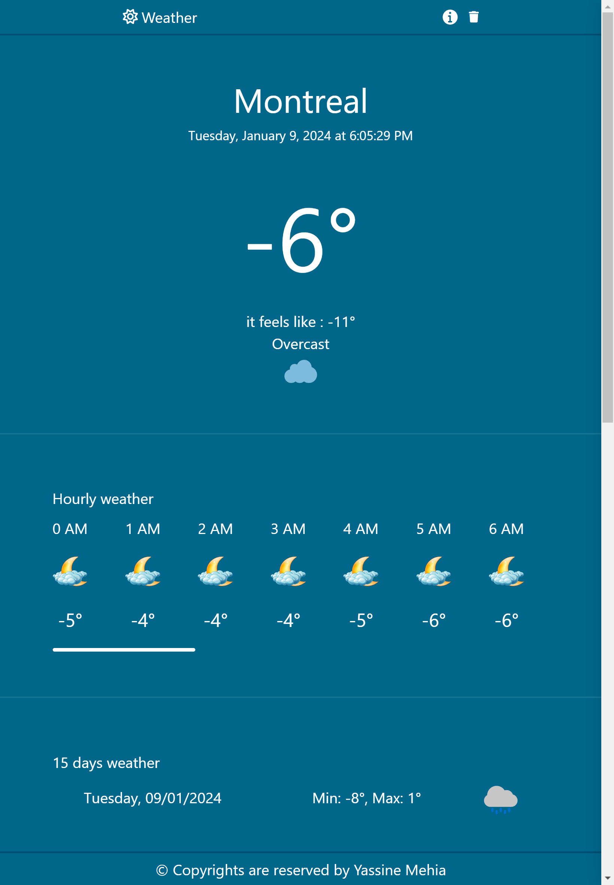
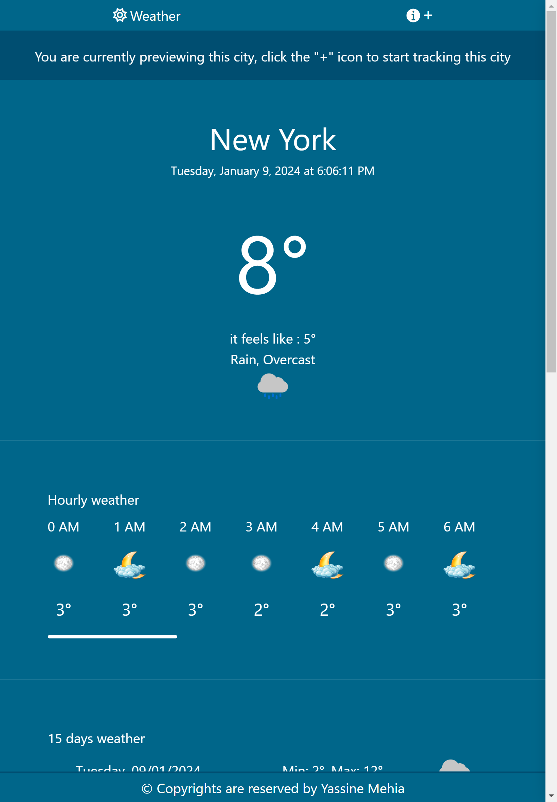

# El Taqqs - Dynamic Weather Web App

## Overview

**El Taqqs** is a dynamic web application built with Vue.js, HTML, CSS, and JavaScript to provide comprehensive weather information. The app offers real-time weather conditions for the current day in 24-hour intervals, displaying local timing for the searched city. Additionally, it provides a 15-day forecast, including minimum and maximum temperatures for each day. Users have the option to add searched cities to a card array for quick reference. The app's technology stack includes Vue.js, Axios for REST API calls, Vuex for state management, Tailwind CSS for styling, and UID for efficient data handling.

## Features

- **Real-time Weather for 24 Hours:**
  - Accurate weather conditions presented in 24-hour intervals for the current day.
  - Local timing displayed based on the searched city, ensuring accurate time representation.

- **Extended 15-Day Forecast:**
  - Forecast for the next 15 days, with a daily breakdown of weather details, including minimum and maximum temperatures.

- **City Management:**
  - Users can add searched cities to a card array displayed on the main view.
  - Each city card contains the city name, along with the maximum and minimum temperatures.

## Technologies Used

- **Vue.js:** A progressive JavaScript framework for building user interfaces.
- **HTML:** Used for creating the structure and layout of the web pages.
- **CSS:** Applied styles to enhance the visual appeal and responsiveness of the user interface.
- **JavaScript:** Implemented to add interactivity and dynamic features to the application.
- **Axios:** Utilized for making REST API calls to fetch real-time weather data.
- **Vuex:** Implemented for state management, ensuring consistency and scalability.
- **Vue Router:** Used for navigation within the Vue.js application.
- **Tailwind CSS:** Used for styling to create a modern and sleek user interface.
- **UID:** A library used for efficient data handling.


## Screenshots
**Main View

  
---
**Async City View  


---
**Mobile Main View


---
**Mobile Async City View


---
**Non Tracked City View


---


## Usage

1. Install dependencies:
   ```bash
   npm install
2.run the server
   ```bash
   npm run serve


## Deployement
You can visit the app at the link : https://weather-app-lac-six-73.vercel.app/#/

